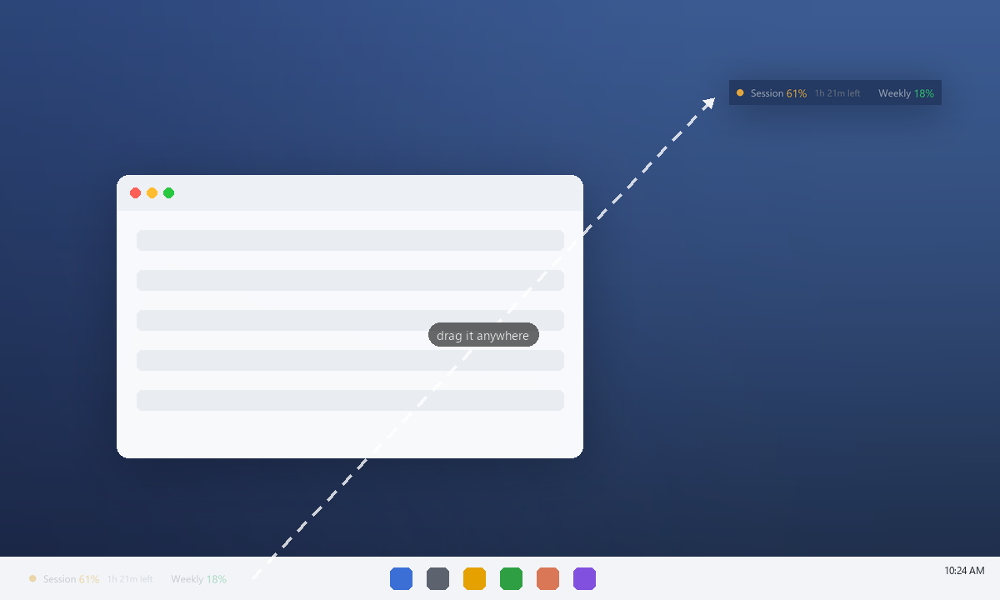
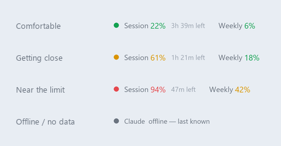
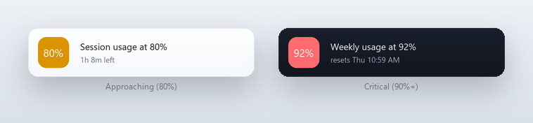
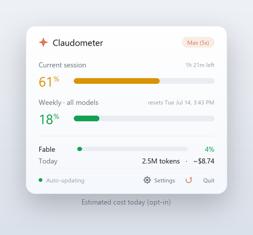
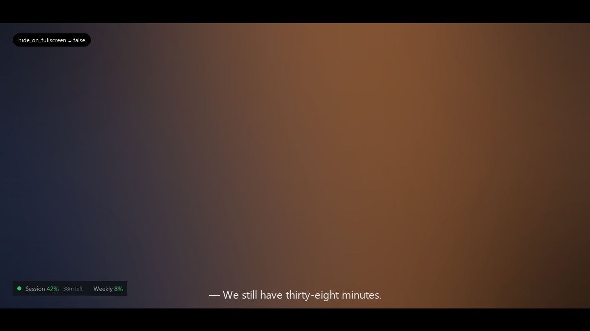
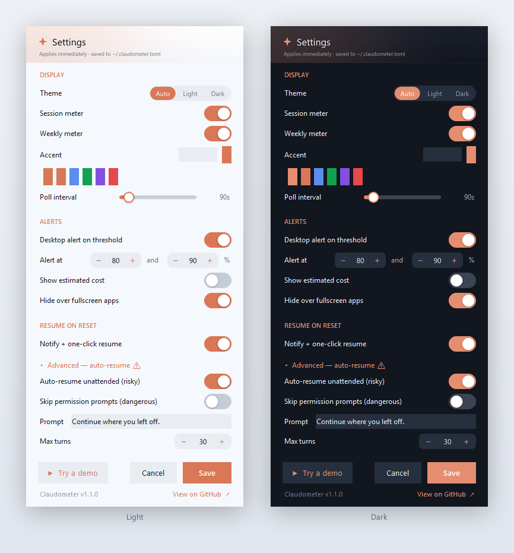

<p align="center"></p>
<h1 align="center">Claudometer</h1>

<p align="center">
  <b>Your Claude usage limits, always visible — right on your taskbar.</b><br>
  A tiny desktop widget that shows your live session &amp; weekly usage, so you never hit a limit by surprise.
</p>

<p align="center">
  
  
  
  
</p>

<p align="center">
  
</p>

> Unofficial — not affiliated with, or endorsed by, Anthropic. [Details ↓](#-disclaimer)

---

## Why

Claude's Pro / Max / Team plans enforce a rolling **5‑hour session** limit and **weekly** limits. Use Claude Code heavily and it's easy to burn through them mid‑task — then get rate‑limited at the worst moment. Checking today means opening the `/usage` panel and *remembering* to look.

**Claudometer keeps that number on‑screen all the time**, as clean floating text that sits on your **taskbar** by default — sampling its color so it blends right in:

<p align="center"></p>

> ### 🖱️ Put it anywhere *(Windows)*
> The **Windows** taskbar strip is a **free‑floating, always‑on‑top** widget — not locked to the taskbar. Drag it to a screen edge, over a window, or onto a second monitor, and it **remembers the spot**.
> *(On macOS it's a native menu‑bar item, which isn't draggable around the screen; a floating Mac widget is on the [roadmap](#roadmap).)*

<p align="center"></p>

- **`Session 61%`** — your current 5‑hour window, with a live countdown to reset.
- **`Weekly 18%`** — your 7‑day, all‑models usage.
- A **color dot** (🟢 &lt;50% · 🟡 50–80% · 🔴 &gt;80%) that flips to a clear **"limit reached"** when you're maxed out, plus a graceful *offline* state:

<p align="center"></p>

**Click it** for the full breakdown — per‑meter reset times, per‑model usage, light/dark:

<p align="center"></p>

### What you get
- 🎯 **Pace yourself** — spot a limit *before* you hit it.
- ⚡ **Zero context‑switch** — the number's already there; no panel to open.
- 🔒 **Zero setup** — reuses your existing Claude login. Nothing to configure.
- 🪶 **Featherweight** — ~0.03% CPU idle, ~50 MB RAM. You won't notice it.
- 🔔 **Alerts** — optional desktop toast when you cross 80% / 90%.
- ⏭️ **Resume** — one click picks up interrupted work when your limit resets (auto‑resume optional).
- 🖥️ **Out of the way** — auto‑hides over fullscreen movies/games (or set it to always show).
- ⚙️ **Tunable** — a built‑in **settings panel** (no file editing) for theme, meters, alerts, accent, cost view, and more.

---

## More screenshots

**macOS** — native menu‑bar item with a dropdown breakdown:
<p align="center"></p>

**Threshold alerts** — a desktop toast the moment you cross a limit you set:
<p align="center"></p>

**Estimated cost** *(opt‑in)* — today's tokens + a rough dollar figure in the popover (a local estimate, not a bill):
<p align="center"></p>

**Always‑visible mode** — keep it readable even over a fullscreen movie or game:
<p align="center"></p>

---

## Install

Requires a **Claude Pro / Max / Team** subscription, signed into **Claude Code** at least once (that's where the login lives).

**Easiest — one command, any OS:**
```bash
pipx install claudometer      # no pipx?  →  python -m pip install --user pipx
claudometer
```
Update later with `pipx upgrade claudometer`.

**Windows:**
```powershell
scoop install https://raw.githubusercontent.com/ali-dev178/claudometer/main/packaging/scoop/claudometer.json
```
…or download the installer (`ClaudometerSetup.exe`, offers "start on sign‑in") or the portable `Claudometer.exe` from [**Releases**](https://github.com/ali-dev178/claudometer/releases).

**macOS:**
```bash
brew install --cask ali-dev178/claudometer/claudometer
```
…or download `Claudometer.dmg` from [**Releases**](https://github.com/ali-dev178/claudometer/releases) and drag it to Applications.

**From source (Python 3.9+):**
```bash
git clone https://github.com/ali-dev178/claudometer.git && cd claudometer
pip install -r requirements.txt
pythonw.exe app.py bar    # Windows (no console)   ·   python3 app.py   # macOS
```

> **Unsigned downloads:** on first launch, Windows ("More info → Run anyway") or macOS (right‑click → **Open**) may ask you to confirm. Installing via `pipx` / `scoop` / `brew` skips that.
>
> **Windows 11 tip:** new taskbar items can get tucked away — drag Claudometer where you want it; it remembers the spot.

---

## Resume when your limit resets

Hit the session limit mid‑task and everything stalls? Claudometer watches your usage recover and helps you pick right back up.

<p align="center"></p>

- **Tier 1 — notify + one click** *(default, safe).* On reset, a notification appears; click **Resume** to open a terminal in the interrupted session's folder running `claude --resume` — you stay in control.
- **Tier 2 — auto‑resume** *(opt‑in, off by default).* After a *"resuming in 20s — click to cancel"* window, it resumes **unattended** so work continues while you're away.

> ⚠️ Tier 2 runs Claude Code with nobody watching. It's off unless you set `resume_auto = true`, and it's guard‑railed: a turn cap plus the safer `acceptEdits` mode by default (full `--dangerously-skip-permissions` only if you *also* opt in). Enable it only for work you trust to run on its own.

---

## Configure

**In‑app (recommended):** click **⚙ Settings** in the popover (or right‑click the strip → *Settings…*). Adjust theme, meters, accent, poll interval, alerts, cost view, fullscreen behavior, and resume — changes apply **instantly** and save to `~/.claudometer.toml` for you.

<p align="center"></p>

**Or edit the file by hand** — copy [`claudometer.example.toml`](claudometer.example.toml) to `~/.claudometer.toml`:
```toml
poll = 90                        # seconds between polls (60–300)
theme = "auto"                   # auto | light | dark
metrics = ["session", "weekly"]  # which meters on the strip
hide_on_fullscreen = true        # false = stay visible, even over fullscreen apps
alerts = true                    # desktop toast on threshold crossings
alert_thresholds = [80, 90]
show_cost = false                # estimated token/$ line in the popover
# accent = "#d97757"             # override the accent color

resume_notify = true             # one-click resume when the session limit resets
resume_auto = false              # Tier 2: unattended auto-resume (opt-in, risky)
resume_prompt = "Continue where you left off."
resume_max_turns = 30            # Tier 2: cap agentic turns
# resume_skip_permissions = false  # Tier 2: --dangerously-skip-permissions (else acceptEdits)
```

Optional environment overrides:

| Env var | Purpose |
|---|---|
| `CLAUDOMETER_CONFIG` | Path to the config file (default `~/.claudometer.toml`). |
| `CLAUDE_CONFIG_DIR` | Where to read Claude credentials (default `~/.claude`). |
| `CLAUDE_WIDGET_POLL` | Poll interval in seconds (60–300), for the tray/menu‑bar. |
| `CLAUDE_WIDGET_FAKE` | Testing: `"95,40,0"` = session,weekly,scoped % (skips the network). Try `$env:CLAUDE_WIDGET_FAKE="95,40,0"; py app.py bar` to preview the red state. |

> On **macOS / Linux** the menu‑bar / tray shows live usage; alerts, cost, resume, and themes apply to the **Windows** strip for now (see [Platform support](#platform-support)).

**Run modes:** `app.py bar` (Windows taskbar strip — default & recommended) · `app.py tray` (tray icon) · `app.py both` · `app.py` (auto per platform). Strip: left‑click = popover · **drag = move it anywhere on screen** (remembered) · right‑click = menu.

> ### ▶ Try a demo
> Want to see every feature without waiting to hit a real limit? Click **Settings → ▶ Try a demo** (or right‑click the strip → **Try a demo**, or run `app.py demo`). Your widget switches **in place** (one window, not a second) into a ~50‑second offline tour covering **every state** — all clearly badged **DEMO**:
> - the color dot cycling **green → amber → red**
> - **session** *and* **weekly** threshold alerts (80% / 90%)
> - the **limit‑reached** and **rate‑limited** states
> - resume‑on‑reset — both **Tier 1** (notify + one click) and **Tier 2** (auto‑resume countdown)
> - the estimated **cost** line (click the strip to see it) and the graceful **offline** state
>
> Pick **◼ Exit demo** to snap back to your real usage. No network, no credentials, nothing real touched.

**Auto‑start on login:** the Windows installer can set this up for you. Manual (from source) — **Windows:** add a shortcut to `pythonw.exe "…\app.py" bar` in `shell:startup`. **macOS:** add the standalone `Claudometer.app` to **System Settings → Login Items**, or use a LaunchAgent for a source install:

<details><summary>macOS LaunchAgent (source install)</summary>

`~/Library/LaunchAgents/com.claudometer.plist`:
```xml
<?xml version="1.0" encoding="UTF-8"?>
<!DOCTYPE plist PUBLIC "-//Apple//DTD PLIST 1.0//EN" "http://www.apple.com/DTDs/PropertyList-1.0.dtd">
<plist version="1.0"><dict>
  <key>Label</key><string>com.claudometer</string>
  <key>ProgramArguments</key>
  <array><string>/usr/bin/python3</string><string>/absolute/path/to/claudometer/app.py</string></array>
  <key>RunAtLoad</key><true/>
</dict></plist>
```
Then: `launchctl load ~/Library/LaunchAgents/com.claudometer.plist`
</details>

---

## How it works

Claudometer reads the OAuth token Claude Code already stores locally (`~/.claude/.credentials.json`, or the macOS Keychain) and polls Anthropic's **server‑reported** usage endpoint — the same source the `/usage` panel uses:

```
GET https://api.anthropic.com/api/oauth/usage
```

So it shows **true plan %** from Anthropic's backend — *not* a local token‑cost guess (unlike tools that tally `*.jsonl` transcripts). Tokens refresh automatically when they expire.

- **Privacy** — your token is read **locally**; the only network call is the authenticated request to `api.anthropic.com`. No third‑party servers, no telemetry, no analytics.
- **Footprint** — ~0.03% CPU idle, ~50 MB RAM. The strip only redraws when a value changes; the popover only while it's open.

---

## Platform support

| Platform | UI | Status |
|---|---|---|
| **Windows 10/11** | Taskbar strip + click‑to‑open popover — **full feature set** | ✅ Full |
| **macOS** | Menu‑bar item + dropdown (live usage) | ✅ |
| **Linux** | Notification‑area tray icon (live usage) | 🧪 Experimental |

Free‑floating placement (drag anywhere), alerts, estimated cost, resume‑on‑reset, themes, accent, the config file, and the demo mode are on the **Windows** strip today; the macOS menu bar and Linux tray show live usage. Unifying these is on the roadmap.

## Roadmap

**Shipped:** desktop alerts · config file + in‑app settings panel · estimated‑cost view · standalone binaries + release CI · pipx / Scoop / Homebrew installs.

**Next:** usage sparkline over the session · unified floating popover on macOS · per‑model cost breakdown · published winget listing.

Ideas and PRs welcome — open an issue.

## Contributing

```bash
pip install -r requirements.txt && py app.py bar   # run it
pip install -r requirements-dev.txt && pytest        # run the tests (also in CI)
```
`usage_core.py` = data/auth (no UI deps) · `render.py` = all the Pillow drawing · `settings.py` / `cost.py` / `resume.py` = config, cost estimation, session‑resume · the platform adapters (`widget_bar.py`, `menubar_mac.py`, `tray_windows.py`) are thin. The `tests/` suite (~385 checks on the core logic) runs on every push via [CI](.github/workflows/ci.yml); regenerate the README images with `py assets/make_assets.py`.

## ⚠️ Disclaimer

Claudometer is an independent, **unofficial** tool — **not affiliated with, authorized, or endorsed by Anthropic**. It relies on an **undocumented** usage endpoint that may change or break at any time, and reads your local Claude Code credentials on your own machine. Use at your own risk and in accordance with Anthropic's Terms of Service. "Claude" is a trademark of Anthropic, PBC.

## License

[MIT](LICENSE) © 2026 Muhammad Ali
