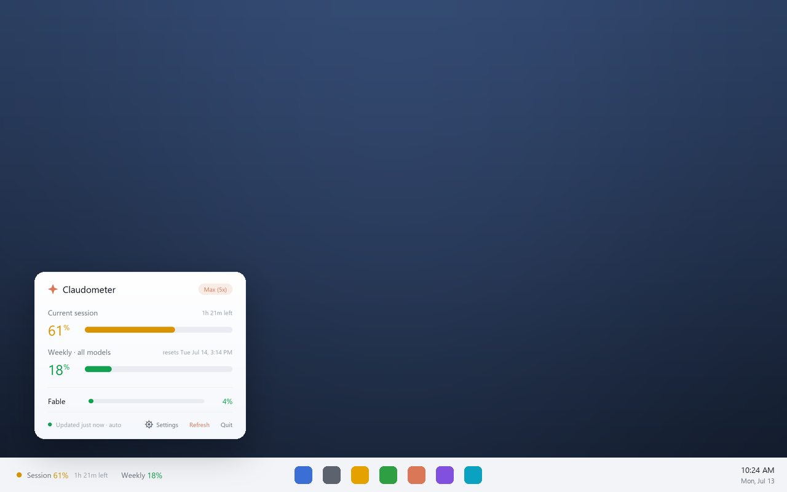
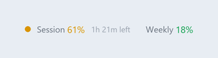
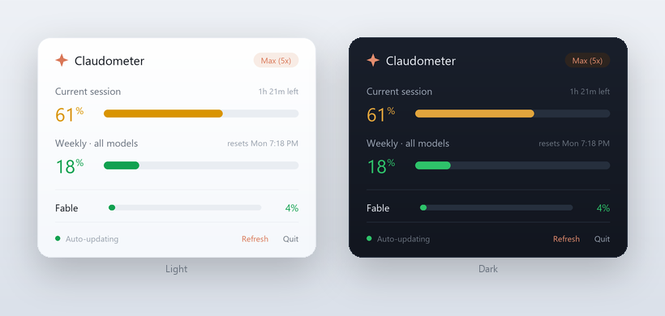
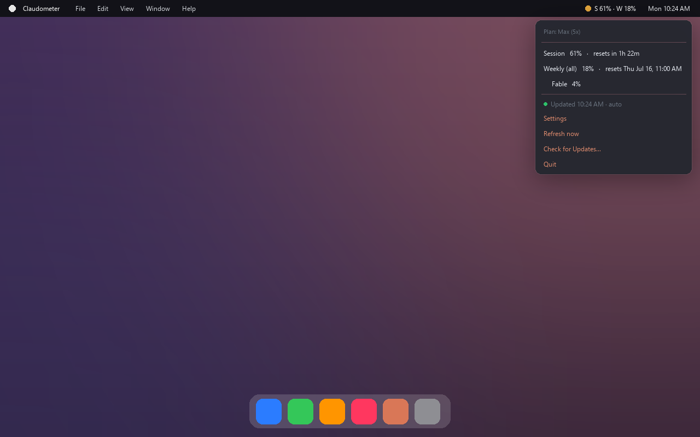
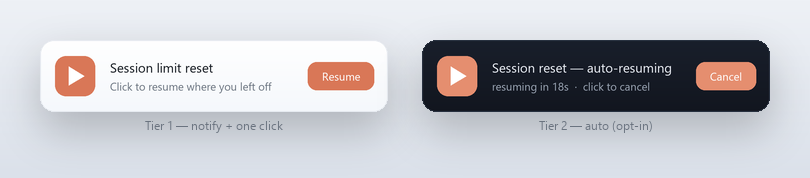

<p align="center"></p>
<h1 align="center">Claudometer</h1>

<p align="center">
  <b>Your Claude usage limits, always visible — right on your taskbar.</b><br>
  A tiny, elegant desktop widget that shows your live session &amp; weekly usage so you never hit a limit by surprise.
</p>

<p align="center">
  
  
  
  
</p>

<p align="center">
  
</p>

> **Unofficial project — not affiliated with, or endorsed by, Anthropic.** See the [disclaimer](#-disclaimer).

---

## The problem

Claude's plans (Pro / Max / Team) enforce **usage limits** — a rolling **5‑hour session** limit and **weekly** limits. If you use Claude heavily (Claude Code, long sessions), it's easy to burn through them without realizing… until you're suddenly rate‑limited in the middle of something important.

Today, checking where you stand means **opening the `/usage` panel or the app and reading it** — a context switch you have to *remember* to do. There's no ambient, at‑a‑glance signal.

## The solution

**Claudometer keeps your usage on‑screen at all times**, as clean floating text on your taskbar:

<p align="center"></p>

- **`Session 61%`** — how much of your current 5‑hour window is used, with a **live countdown** to reset (`1h 21m left`).
- **`Weekly 18%`** — your 7‑day all‑models usage.
- A **color‑coded status dot** (🟢 &lt;50% · 🟡 50–80% · 🔴 &gt;80%) so severity registers in a glance.

**Click it** for a polished breakdown with per‑meter reset times and per‑model (e.g. Opus) usage:

<p align="center"></p>

### Why you'll want it
- 🎯 **Pace yourself** — see when you're approaching a limit *before* you hit it.
- ⚡ **Zero context‑switch** — the number is already there; no panel to open.
- 🔒 **Zero setup** — reuses your existing Claude login. Nothing to configure.
- 🪶 **Featherweight** — ~0.03% CPU idle, ~50 MB RAM. You won't notice it.
- 🖥️ **Stays out of the way** — auto‑hides over fullscreen movies, games, and presentations.
- 🔔 **Warns you in time** — optional desktop alerts when you cross 80% / 90%.
- ⏭️ **Picks up where you left off** — when your session limit resets, one click resumes the interrupted work (or auto‑resume, if you opt in).
- 🎨 **Looks the part** — supersampled rendering, light/dark aware, adapts to your taskbar.
- ⚙️ **Yours to tune** — an optional config file for interval, theme, alerts, accent, and an estimated‑cost view.

---

## Screenshots

**Windows** — floating strip on the taskbar + click‑to‑open popover with usage meters:

<p align="center"></p>

**macOS** — native menu‑bar item with a dropdown breakdown:

<p align="center"></p>

---

## Resume when your limit resets

Hit the 5‑hour session limit mid‑task and everything grinds to a halt? Claudometer
knows the *exact* reset time, so it can help you pick right back up.

<p align="center"></p>

- **Tier 1 — notify + one click** *(default, safe).* When your session resets, a
  notification appears; click **Resume** and it opens a terminal in the interrupted
  session's folder running `claude --resume <id>` for you to continue — supervised.
- **Tier 2 — auto‑resume** *(opt‑in, off by default).* After a short *"resuming in
  20s — click to cancel"* window, it resumes **unattended and headless** so work
  continues while you're away.

> ⚠️ **Tier 2 runs Claude Code with nobody watching.** It's gated behind
> `resume_auto = true` and ships with guard rails: a turn cap (`--max-turns`) and
> the safer `acceptEdits` permission mode by default (full
> `--dangerously-skip-permissions` only if you *also* set
> `resume_skip_permissions = true`). Enable it only for work you trust to run on
> its own. Output is written to a log in `~/.claude/`.

Configure both in the [config file](#configuration).

---

## Install

You need a **Claude Pro / Max / Team** subscription and to have **signed into Claude Code** at least once (that's where the credentials live).

### Option A — Standalone binary (no Python)
Grab `Claudometer.exe` (Windows) or `Claudometer-macos.zip` (macOS) from
[**Releases**](https://github.com/<your-username>/claudometer/releases) — unzip the
macOS build to get `Claudometer.app` — then run it. On Windows, drag the taskbar
readout where you like (it remembers the spot); on macOS it appears as a menu-bar
item. Add it to startup / login items to launch automatically.

### Option B — From source (Python 3.9+)
```bash
git clone https://github.com/<your-username>/claudometer.git
cd claudometer
```
**Windows**
```powershell
py -m pip install -r requirements.txt
pythonw.exe app.py bar     # runs with no console window
```
**macOS**
```bash
python3 -m pip install -r requirements.txt
python3 app.py             # adds a menu-bar item
```

Build your own binaries with [`packaging/`](packaging/) (PyInstaller + CI).

> First run tip (Windows): Windows 11 may tuck new taskbar items away — drag Claudometer to where you want it; it remembers the position.

## Usage

| Command | What you get |
|---|---|
| `app.py bar` | **Windows:** floating taskbar strip + popover *(recommended)* |
| `app.py tray` | **Windows/Linux:** notification‑area tray icon |
| `app.py both` | **Windows:** taskbar strip **and** tray icon |
| `app.py` | Default — **macOS:** menu bar · **Windows:** taskbar strip · **Linux:** tray |

**Interactions (taskbar strip):** left‑click = open/close popover · drag = move (remembered) · right‑click = Details / Refresh / Quit.

## Auto‑start on login

**Windows** — press `Win`+`R`, run `shell:startup`, and add a shortcut to:
```
pythonw.exe "C:\path\to\claudometer\app.py" bar
```

**macOS** — add a LaunchAgent at `~/Library/LaunchAgents/com.claudometer.plist`:
```xml
<?xml version="1.0" encoding="UTF-8"?>
<!DOCTYPE plist PUBLIC "-//Apple//DTD PLIST 1.0//EN" "http://www.apple.com/DTDs/PropertyList-1.0.dtd">
<plist version="1.0"><dict>
  <key>Label</key><string>com.claudometer</string>
  <key>ProgramArguments</key>
  <array><string>/usr/bin/python3</string><string>/absolute/path/to/claudometer/app.py</string></array>
  <key>RunAtLoad</key><true/>
</dict></plist>
```
then `launchctl load ~/Library/LaunchAgents/com.claudometer.plist`.

## Configuration

> The config file, alerts, cost view, resume, theme and accent apply to the
> **Windows taskbar strip** (`bar` mode). The macOS menu bar and Linux tray show
> usage but ignore these options (see [Platform support](#platform-support)).

Everything works with no config. To customise, copy
[`claudometer.example.toml`](claudometer.example.toml) to `~/.claudometer.toml`:

```toml
poll = 90                        # seconds between polls (60–300)
theme = "auto"                   # auto | light | dark
metrics = ["session", "weekly"]  # which meters on the strip
alerts = true                    # desktop toast on threshold crossings
alert_thresholds = [80, 90]
show_cost = false                # estimated token/$ line in the popover
# accent = "#d97757"             # override the accent color

resume_notify = true             # one-click resume when the session limit resets
resume_auto = false              # Tier 2: unattended auto-resume (opt-in, risky)
resume_prompt = "Continue where you left off."
resume_max_turns = 30            # Tier 2: cap agentic turns
# resume_skip_permissions = false  # Tier 2: --dangerously-skip-permissions (else acceptEdits)
```

Environment overrides:

| Env var | Purpose |
|---|---|
| `CLAUDOMETER_CONFIG` | Path to the config file (default `~/.claudometer.toml`). |
| `CLAUDE_CONFIG_DIR` | Where to read Claude credentials/transcripts (default `~/.claude`). |
| `CLAUDE_WIDGET_POLL` | Poll interval in seconds (60–300). The interval source for the Windows/Linux **tray** (the macOS menu bar polls at a fixed 90s). |
| `CLAUDE_WIDGET_FAKE` | Testing: `"95,40,0"` = session,weekly,scoped % (skips the network). |

Preview the red/alert state with no real load:
```powershell
$env:CLAUDE_WIDGET_FAKE="95,40,0"; py app.py bar
```

---

## How it works

Claudometer reads the OAuth token Claude Code already stores locally
(`~/.claude/.credentials.json`, or the macOS Keychain) and polls Anthropic's
**server‑reported** usage endpoint — the same source the `/usage` panel uses:

```
GET https://api.anthropic.com/api/oauth/usage
```

The response maps directly onto the UI: the 5‑hour window → **Session**, the
7‑day all‑models window → **Weekly**, and any per‑model scoped limits → per‑model
rows (e.g. **Opus**). Tokens are refreshed automatically when they expire.

> This is *true plan %* from Anthropic's backend — **not** a local token‑cost
> estimate (unlike tools that add up `*.jsonl` transcript costs).

### Privacy
- Your token is read **locally**; the only network call is the authenticated
  request to `api.anthropic.com`.
- **No** third‑party servers, **no** telemetry, **no** analytics.

### Behavior notes
- **Fullscreen auto‑hide** — Claudometer hides itself whenever a fullscreen app
  is active (movies, games, presentations), using Windows' own
  `SHQueryUserNotificationState` plus a foreground‑covers‑the‑screen check, then
  reappears when you exit. On macOS the menu bar hides in fullscreen natively.
- **Performance** — ~0.03% of total CPU idle, ~0.2% while you have the popover
  open, ~50 MB RAM. The strip only re‑renders when a value changes; the popover
  only while it's open.

## Platform support

| Platform | UI | Status |
|---|---|---|
| **Windows 10/11** | Taskbar strip + click‑to‑open popover | ✅ Full |
| **macOS** | Menu‑bar item + dropdown | ✅ Menu bar |
| **Linux** | Notification‑area tray icon | 🧪 Experimental (`app.py tray`) |

> **Feature scope:** the taskbar strip (Windows) has the full feature set —
> click‑to‑open popover, alerts, estimated cost, resume‑on‑reset, themes, accent,
> and the config file. The macOS menu bar and Linux tray currently show live
> usage only. Unifying these is on the roadmap.

## Roadmap

**Shipped:** ✅ desktop alerts · ✅ config file · ✅ estimated cost view · ✅ standalone binaries + release CI.

**Next up:**
- 📈 A tiny **usage sparkline** over the session
- 🍎 Unified floating popover on macOS (currently a native menu‑bar item)
- 🧮 Per‑model cost breakdown & weekly totals
- 📥 Published **winget** / **Homebrew** listings

Contributions and ideas welcome — open an issue or PR.

## Contributing

```bash
py -m pip install -r requirements.txt
py app.py bar
```
`usage_core.py` holds the data/auth logic (no UI deps), `render.py` does all the
Pillow drawing, `settings.py` / `cost.py` / `resume.py` add config, cost
estimation, and session‑resume, and the platform adapters (`widget_bar.py`,
`menubar_mac.py`, `tray_windows.py`) are thin. Regenerate the README images with
`py assets/make_assets.py`.

## ⚠️ Disclaimer

Claudometer is an **independent, unofficial** tool. It is **not affiliated with,
authorized, or endorsed by Anthropic**. It relies on an **undocumented** usage
endpoint that may change or break at any time, and reads the local Claude Code
credentials on your own machine. Use at your own risk, and in accordance with
Anthropic's Terms of Service. "Claude" is a trademark of Anthropic, PBC.

## License

[MIT](LICENSE) © 2026 Muhammad Ali
